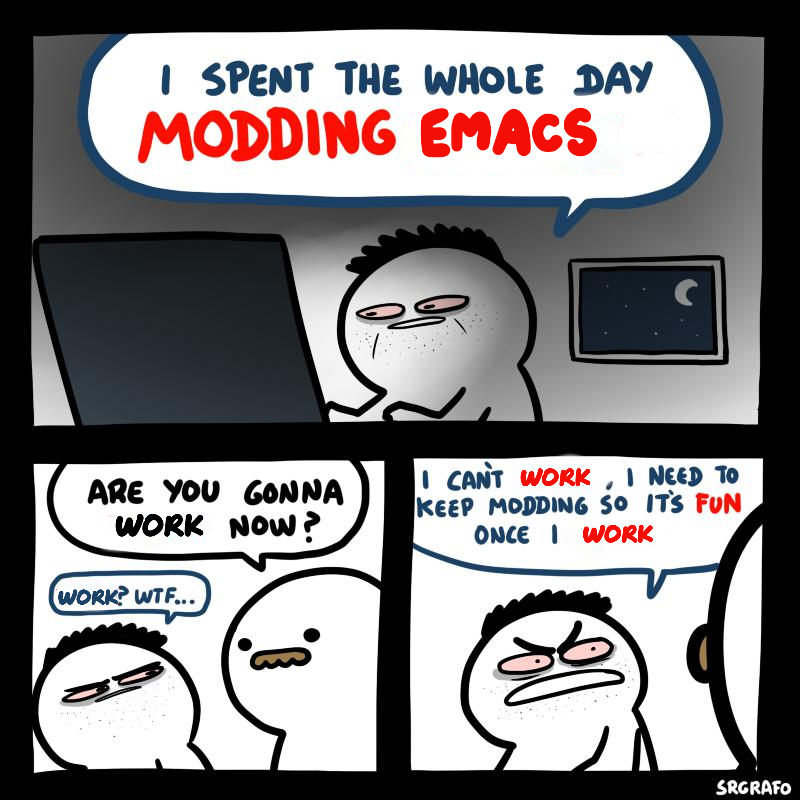

#+TITLE: Emacs Configuration

* Load package.el and MELPA repository
#+begin_src emacs-lisp
  (require 'package)
  (add-to-list 'package-archives '("melpa" . "http://melpa.org/packages/") t)
  (package-initialize)
#+end_src

* Load use-package
#+begin_src emacs-lisp
  (unless (package-installed-p 'use-package)
    (package-refresh-contents)
    (package-install 'use-package))
  (eval-when-compile
    (require 'use-package))
  (setq use-package-always-ensure t)
#+end_src

* User's setting
** Coding system & fonts
#+begin_src emacs-lisp
  (prefer-coding-system       'utf-8-unix)
  (set-default-coding-systems 'utf-8-unix)
  (set-terminal-coding-system 'utf-8-unix)
  (set-keyboard-coding-system 'utf-8-unix)
  (setq default-buffer-file-coding-system 'utf-8-unix)
#+end_src

** Fonts
#+begin_src emacs-lisp
  (push '("Droid Sans Mono" "Consolas") face-font-family-alternatives)
  (push '("Monospace" "Consolas") face-font-family-alternatives)
  (push '("Noto Color Emoji" "Segoe UI Emoji") face-font-family-alternatives)
  (internal-set-alternative-font-family-alist face-font-family-alternatives)

  (set-fontset-font t 'symbol "Noto Color Emoji")
  (add-to-list 'default-frame-alist '(font . "Monospace 11"))
#+end_src

** Key-bindings
#+begin_src emacs-lisp
  (use-package which-key
    :config (which-key-mode)
    :hook
    (visual-line-mode . (lambda ()
                          (dolist (i '(("S-<wheel-down>" . scroll-left)
                                       ("S-<wheel-up>" . scroll-right)))
                            (if visual-line-mode
                                (local-unset-key (kbd (car i)))
                              (local-set-key (kbd (car i)) `(lambda ()
                                                              (interactive)
                                                              (,(cdr i) 3)))))))
    :bind (([mouse-8] . previous-buffer)
           ([mouse-9] . next-buffer)
           ([C-f5] . revert-buffer)
           ("C-x k" . kill-current-buffer)
           ("C-c k" . kill-whole-line)
           ("C-c c" . conf-mode)
           ("C-y" . yank)
           ("C-c <up>" . windmove-up)
           ("C-c <down>" . windmove-down)
           ("C-c <left>" . windmove-left)
           ("C-c <right>" . windmove-right)
           ("C-<return>" . eval-region)
           :map dired-mode-map
           ([mouse-2] . dired-mouse-find-file)
           ([mouse-3] . dired-mouse-find-file-other-window)))
#+end_src

** Other customize
#+begin_src emacs-lisp
  (use-package my-custom
    :ensure nil
    :after (dired)
    :mode (("Makefile\\.*?" . makefile-mode))
    :hook
    (prog-mode . (lambda ()
                   (display-fill-column-indicator-mode)
                   (display-line-numbers-mode)
                   (hl-line-mode)
                   (electric-indent-local-mode)))
    (tty-setup . (lambda () (hl-line-mode -1)))
    (find-file . (lambda ()
                   (when (and buffer-file-name (file-remote-p buffer-file-name))
                     (setq-local vc-handled-backends nil))))
    :init (setq tab-width 4)
    :custom
    (c-basic-offset tab-width)
    (c-tab-always-indent nil)
    (column-number-mode t)
    ;;(desktop-save-mode 1)
    (electric-indent-mode nil)
    (electric-pair-mode t)
    (fill-column 80)
    (global-visual-line-mode t)
    (indent-tabs-mode t)
    (inhibit-startup-screen t)
    (initial-major-mode 'prog-mode)
    ;;(initial-scratch-message (shell-command-to-string ""))
    (kill-buffer-delete-auto-save-files t)
    (line-number-mode nil)
    (make-backup-files nil)
    (menu-bar-mode nil)
    (mode-require-final-newline nil)
    (mouse-wheel-follow-mouse 't)
    (mouse-wheel-progressive-speed t)
    (mouse-wheel-scroll-amount '(1 ((shift) . 1) ((control))))
    (scroll-bar-mode nil)
    (show-paren-mode t)
    (show-trailing-whitespace t)
    (sqlind-basic-offset tab-width)
    (tool-bar-mode nil)
    (tramp-copy-size-limit -1)
    (tramp-use-ssh-controlmaster-options nil))
#+end_src

** Common user access
#+begin_src emacs-lisp
  (use-package cua-base
    :hook (makefile-mode . cua-mode)
    :bind (:map cua--cua-keys-keymap
                ("C-z" . undo-only)
                ("C-S-z" . undo-redo))
    :custom
    (cua-rectangle-mark-key [C-M-return])
    (cua-mode t))
#+end_src

** Recentf
#+begin_src emacs-lisp
  (use-package recentf
    :custom (recentf-auto-cleanup 'never)
    :config (recentf-mode t))
#+end_src

** C-style
#+begin_src emacs-lisp
  (defun c-lineup-arglist-tabs-only (ignored)
    "Line up argument lists by tabs, not spaces"
    (let* ((anchor (c-langelem-pos c-syntactic-element))
           (column (c-langelem-2nd-pos c-syntactic-element))
           (offset (- (1+ column) anchor))
           (steps (floor offset c-basic-offset)))
      (* (max steps 1)
         c-basic-offset)))

  (c-add-style "linux-kernel"
               '("bsd"
                 (c-basic-offset . 8)
                 (c-label-minimum-indentation . 0)
                 (c-offsets-alist
                  ;;(arglist-close         . c-lineup-arglist-tabs-only)
                  (arglist-cont-nonempty .
                                         (c-lineup-gcc-asm-reg c-lineup-arglist-tabs-only))
                  (arglist-intro         . +)
                  (brace-list-intro      . +)
                  (c                     . c-lineup-C-comments)
                  (case-label            . 0)
                  (comment-intro         . c-lineup-comment)
                  (cpp-define-intro      . +)
                  (cpp-macro             . -1000)
                  (cpp-macro-cont        . +)
                  (defun-block-intro     . +)
                  (else-clause           . 0)
                  (func-decl-cont        . +)
                  (inclass               . +)
                  (inher-cont            . c-lineup-multi-inher)
                  (knr-argdecl-intro     . 0)
                  (label                 . -1000)
                  (statement             . 0)
                  (statement-block-intro . +)
                  (statement-case-intro  . +)
                  (statement-cont        . +)
                  (substatement          . +))))
  (add-to-list 'c-default-style '(c-mode . "linux-kernel"))
  (c-set-offset 'access-label '/)
#+end_src

** Sort words
#+begin_src emacs-lisp
  (defun sort-words (reverse beg end)
    "Sort words in region alphabetically, in REVERSE if negative.
  Prefixed with negative \\[universal-argument], sorts in reverse.
  The variable `sort-fold-case' determines whether alphabetic case affects the sort order.

  See `sort-regexp-fields'."
    (interactive "*P\nr")
    (sort-regexp-fields reverse "\\w+" "\\&" beg end))
#+end_src

** Clear undo history
#+begin_src emacs-lisp
  (defun clear-undo-history ()
    "Clear buffer undo history"
    (interactive)
    (buffer-disable-undo)
    (buffer-enable-undo))
#+end_src

** Toggle transparency
#+begin_src emacs-lisp
  (setq opacity 85)
  (add-to-list 'default-frame-alist `(alpha . ,opacity))

  (defun toggle-transparency ()
    "Toggle transparency of the Emacs frame."
    (interactive)
    (let ((alpha (frame-parameter (selected-frame) 'alpha)))
      (if (eq alpha 100)
          (set-frame-parameter (selected-frame) 'alpha opacity)
        (set-frame-parameter (selected-frame) 'alpha 100))))
  (global-set-key (kbd "C-c t") 'toggle-transparency)
#+end_src

** Window path config
#+begin_src emacs-lisp
  (when (eq system-type 'windows-nt)
    (let ((bash (executable-find "bash")))
      (when bash
        (push (expand-file-name "../usr/bin" (file-name-directory bash)) exec-path)))
    (let ((path (mapcar 'file-truename
                        (append exec-path
                                (split-string (getenv "PATH") path-separator t)))))
      (setenv "PATH" (mapconcat 'identity (delete-dups path) path-separator))))
#+end_src

* Interface packages
** Monokai theme
#+begin_src emacs-lisp
  (use-package monokai-theme
    :config (load-theme 'monokai t))
#+end_src

** Nyancat the cutest
#+begin_src emacs-lisp
  (use-package nyan-mode
    :custom
    (nyan-animation-frame-interval 0.07)
    (nyan-wavy-trail t)
    (nyan-animate-nyancat t)
    :config
    (nyan-mode))
#+end_src

** Helm
#+begin_src emacs-lisp
  (use-package helm
    :bind (([remap find-file] . helm-find-files)
           ([remap execute-extended-command] . helm-M-x)
           ([remap switch-to-buffer] . helm-mini)
           ([remap occur] . helm-occur)
           (:map helm-find-files-map
                 ("C-<tab>" . file-cache-minibuffer-complete)))
    :custom
    (helm-ff-file-name-history-use-recentf t)
    (helm-move-to-line-cycle-in-source nil)
    :config (helm-mode))

  (use-package helm-xref)
  (use-package helm-projectile)
#+end_src

** Highlighting hex color
#+begin_src emacs-lisp
  (use-package rainbow-mode
    :hook (web-mode lua-mode))
#+end_src

** Transpose frame
#+begin_src emacs-lisp
  (use-package transpose-frame
    :bind ("C-|" . transpose-frame))
#+end_src

** Control popup window
#+begin_src emacs-lisp
  (use-package popwin
    :hook (after-init)
    :bind-keymap ("C-x p" . popwin:keymap)
    :custom (popwin:popup-window-height 15)
    :config
    (dolist (cfg '(("^*\\(vterm\\|.*shell.*\\|Breakpoints\\|Flycheck.*\\|Org.*\\)\\*$" :stick t :regexp t)
                   ("*Buffer List*")
                   ("*Warnings*" :stick t :height 5)
                   ("^\\*\\(sqls results\\|.*debug.*\\|platformio-.*\\)\\*$" :stick t :regexp t :noselect t)))
      (push cfg popwin:special-display-config)))
#+end_src

* Development packages
** EGLOT - Language Server Protocol
#+begin_src emacs-lisp
  (use-package eglot
    :hook ((asm-mode c-mode c++-mode css-mode go-mode java-mode javascript-mode python-mode rust-mode sql-mode web-mode) . eglot-ensure)
    :mode (("\\.ino\\'" . c-mode))
    :config
    (add-to-list 'tramp-remote-path 'tramp-own-remote-path)
    (add-to-list 'eglot-server-programs
                 '((c-mode c++-mode) . ("clangd" "--stdio"))))
#+end_src

** DAP - Debug Adapter Protocol
#+begin_src emacs-lisp
  (use-package dap-mode
    :custom
    (dap-auto-show-output nil)
    (dap-debug-restart-keep-session nil)
    (dap-inhibit-io nil)
    (dap-internal-terminal 'dap-internal-terminal-vterm)
    (dap-lldb-debug-program '("/usr/bin/lldb-dap"))
    :bind ((   [f5] . dap-debug)
           ( [S-f5] . dap-disconnect)
           (   [f7] . dap-ui-expressions-add)
           (   [f9] . dap-breakpoint-toggle)
           ( [S-f9] . dap-breakpoint-delete-all)
           (  [f10] . dap-next)
           (  [f11] . dap-step-in)
           ([S-f11] . dap-step-out))
    :commands dap-debug
    :config
    ;; Python
    (require 'dap-python)
    ;; C/C++
    (require 'dap-cpptools)
    (dap-cpptools-setup)
    (add-to-list 'dap-debug-template-configurations
                 '("cpptools::QuickDebug"
                   :type "cppdbg"
                   :request "launch"
                   :name "Quick debug"
                   :MIMode "gdb"
                   :program "${fileDirname}/${fileBasenameNoExtension}"
                   :stopatentry "false"
                   :dap-compilation "make"
                   :dap-compilation-dir "${fileDirname}"
                   :cwd "${workspaceFolder}"))

    (require 'dap-lldb)
    (add-to-list 'dap-debug-template-configurations
                 '("lldb-dap::C++ debug"
                   :name "lldb-dap :: C++ debug"
                   :type "lldb-vscode"
                   :lldbServerPath "/usr/bin/lldb-server"
                   :valuesFormatting "prettyPrinters" ;; Show std containers elements
                   :request "launch"
                   :MIMode "gdb"
                   :program "${fileDirname}/${fileBasenameNoExtension}"
                   :stopAtEntry "false"
                   :dap-compilation "make"
                   :dap-compilation-dir "${fileDirname}"
                   :cwd "${workspaceFolder}")))
#+end_src

** Text completion
#+begin_src emacs-lisp
  (use-package company
    :bind ("C-'" . company-files)
    :hook (find-file . (lambda ()
                         (when (file-remote-p default-directory))
                         (company-mode -1)))
    :config (global-company-mode t))

  (use-package company-c-headers
    :config
    (add-to-list 'company-backends 'company-c-headers)
    (add-to-list 'company-c-headers-path-user "/usr/include/c++/"))

  (use-package company-go)
  (use-package company-lua)

  (use-package yasnippet
    :config (yas-global-mode t))

  (use-package yasnippet-snippets)
#+end_src

** Projectile
#+begin_src emacs-lisp
  (use-package projectile
    :bind-keymap ("C-c p" . projectile-command-map)
    :custom
    (projectile-enable-caching 'persistent)
    (projectile-globally-ignored-file-suffixes
     '(".o" ".ko" ".mod" ".cmd" ".order" ".symvers" ".d" ".a" ".dep" ".dtb"))
    :config
    (dolist (dir '("*built" "*objs" "bin"))
      (add-to-list 'projectile-globally-ignored-directories dir))
    (projectile-mode))

  (use-package treemacs-projectile
    :custom (treemacs-width 25)
    :bind ((  [f8] . treemacs-select-window)
           ([C-f8] . treemacs)
           ([S-f8] . treemacs-switch-workspace)
           ([M-f8] . treemacs-projectile)))
#+end_src

** Ediff
#+begin_src emacs-lisp
  (use-package ediff
    :bind (("C-c e b" . ediff-buffers)
           ("C-c e f" . ediff-files)
           ("C-c e d" . ediff-directories))
    :custom ediff-split-window-function (quote split-window-horizontally)
    :config
    (dolist (face '((ediff-even-diff-A . "#89706A")
                    (ediff-even-diff-B . "#637163")
                    (ediff-odd-diff-A . "#876860")
                    (ediff-odd-diff-B . "#64776C")))
      (face-spec-set (car face) `((t (:background ,(cdr face) :extend t))))))
#+end_src

** Multiple occurences edit
#+begin_src emacs-lisp
  (use-package iedit)
#+end_src

** Format code
#+begin_src emacs-lisp
  (use-package format-all
    :bind ("M-s f" . format-all-buffer)
    :hook
    (prog-mode . format-all-mode)
    (before-save . format-all-buffer))
#+end_src

** SQL indent
#+begin_src emacs-lisp
  (use-package sql-indent
    :hook (sql-mode . sqlind-minor-mode))
#+end_src

** Lua
#+begin_src emacs-lisp
  (use-package lua-mode
    :custom (lua-indent-level 2)
    :hook (disable-electric-indent-mode))
#+end_src

** Rust Cargo
#+begin_src emacs-lisp
  (use-package rust-mode)
  (use-package cargo
    :hook (rust-mode . cargo-minor-mode))
#+end_src

** Python
#+begin_src emacs-lisp
  (use-package python-mode
    :hook (python-mode . (lambda ()
                           (setq-local require-final-newline t))))
#+end_src

** JSON
#+begin_src emacs-lisp
  (use-package json-mode
    :hook (json-mode . (lambda()
                         (make-local-variable 'js-indent-level)
                         (setq js-indent-level 2))))
#+end_src

** PlatformIO
#+begin_src emacs-lisp
  (use-package platformio-mode
    :hook (c++-mode . platformio-conditionally-enable)
    :config
    (setq platformio/related-files
          (list
           (projectile-related-files-fn-extensions :other '("cpp" "h" "hpp"))))
    (projectile-register-project-type 'platformio '("platformio.ini")
                                      :project-file "platformio.ini"
                                      :compile "pio run"
                                      :run "pio run -t upload"
                                      :related-files-fn platformio/related-files))
#+end_src

** Web development
#+begin_src emacs-lisp
  (use-package web-mode
    :mode ("\\.html?\\'")
    :custom
    (web-mode-enable-auto-indentation nil)
    (web-mode-enable-auto-quoting nil)
    (web-mode-enable-current-column-highlight t)
    (web-mode-enable-current-element-highlight t)
    (web-mode-enable-element-content-fontification t)
    (web-mode-enable-html-entities-fontification t)
    (web-mode-markup-indent-offset 4))

  (use-package impatient-mode
    :hook (web-mode javascript-mode))

  (use-package emmet-mode
    :hook (web-mode))

  (use-package go-mode)
  (use-package typescript-mode)
#+end_src

* Other packages
** Auto update
#+begin_src emacs-lisp
  (use-package auto-package-update
    :custom
    (auto-package-update-interval 7)
    (auto-package-update-prompt-before-update t)
    (auto-package-update-hide-results t)
    :config
    (auto-package-update-maybe)
    (auto-package-update-at-time "09:00"))
#+end_src

** Conf-mode
#+begin_src emacs-lisp
  (use-package conf-mode
    :mode ("_defconfig\\'" "_config\\'")
    :hook (conf-mode . (lambda ()
                         (setq indent-line-function #'insert-tab
                               indent-tabs-mode t))))
#+end_src

** Markdown mode
#+begin_src emacs-lisp
  (use-package markdown-mode
    :custom
    (markdown-enable-math t)
    (markdown-fontify-code-blocks-natively t))
#+end_src

** Terminal
#+begin_src emacs-lisp
  (if (eq system-type 'gnu/linux)
      (use-package vterm
        :bind (("C-k" . vterm)
               :map vterm-mode-map
               ("C-k" . previous-multiframe-window)
               ("C-q" . vterm-send-next-key)
               ("C-S-v" . vterm-yank)))
    (use-package shell
      :bind ("C-k" . shell)
      :custom (eshell-scroll-show-maximum-output nil)
      :hook (shell-mode . (lambda ()
                            (local-set-key (kbd "C-l") 'comint-clear-buffer)))))

  (use-package ssh
    :custom (ssh-explicit-args '("-tt")))
#+end_src

** Open file in external program
#+begin_src emacs-lisp
  (use-package openwith
    :custom
    (openwith-associations '(("\\.pdf\\'" "microsoft-edge-dev" (file))
                             ("\\.mp3\\'" "sox" (file))
                             ("\\.\\(?:mpe?g\\|avi\\|wmv\\)\\'" "mpv" (file))))
    :config (openwith-mode t))
#+end_src

** Discord rich presence
#+begin_src emacs-lisp
  (use-package elcord
    :config (elcord-mode))
#+end_src

* ORG-MODE
** Keybindings
#+begin_src  emacs-lisp
  (use-package org
    :hook (org-mode . (lambda()
                        (visual-line-mode)
                        (variable-pitch-mode)
                        (prettify-symbols-mode)))
    :bind (:map org-mode-map
                ("C-c a" . org-agenda-list)
                ("C-c c" . org-capture)
                ("C-c l f" . org-toggle-latex-fragment)
                ("C-c l e" . org-edit-latex-fragment)
                ("C-c l p" . org-preview-later-fragment))
    :config
    (require 'org-tempo)
    (setq-default prettify-symbols-alist '(("#+begin_src" . "```")
                                           ("#+end_src" . "```")
                                           (">=" . "≥")
                                           ("<=" . "≤")
                                           ("=>" . "⇨")))
    (unbind-key "C-S-<up>" org-mode-map)
    (unbind-key "C-S-<down>" org-mode-map)
    (font-lock-add-keywords
     'org-mode
     '(("^ *\\([-]\\) " (0 (prog1 () (compose-region (match-beginning 1) (match-end 1) "•"))))))
    (font-lock-add-keywords
     'org-mode
     '(("^ *\\([+]\\) " (0 (prog1 () (compose-region (match-beginning 1) (match-end 1) "◦"))))))
    :custom
    (org-adapt-indentation nil)
    (org-agenda-files '("~"))
    (org-edit-src-content-indentation 2)
    (org-ellipsis " ⤵")
    (org-fontify-done-headline t)
    (org-format-latex-options
     '(:foreground default :background default :scale 1.5 :html-foreground "Black" :html-background "Transparent" :html-scale 1.0 :matchers ("begin" "$1" "$" "$$" "\\(" "\\[")))
    (org-hide-emphasis-markers t)
    (org-hide-leading-stars t)
    (org-startup-with-latex-preview t)
    (org-src-tab-acts-natively t)
    (org-support-shift-select t)
    (org-todo-keywords
     '((sequence "☛ TODO(t)" "⚒ IN-PROGRESS(p)" "|" "✔ DONE(d)")
       (sequence "🚫 BLOCKED(b)" "⏸ ONHOLD(h)" "|" "✘ CANCELED(c)"))))
#+end_src

** Org-bullets
#+begin_src emacs-lisp
  (use-package org-bullets
    :hook (org-mode . org-bullets-mode))
#+end_src

** Org-fancy-priorities
#+begin_src emacs-lisp
  (use-package org-fancy-priorities
    :hook (org-mode . org-fancy-priorities-mode)
    :custom (org-fancy-priorities-list '("⚡" "⬆" "⬇" "☕")))
#+end_src

** Org faces
#+begin_src emacs-lisp
  (dolist (face '(org-block
                  org-document-info-keyword
                  org-property-value
                  org-special-keyword
                  org-verbatim))
    (set-face-attribute face nil :inherit 'fixed-pitch :height 1.0))
  (set-face-attribute 'org-table nil :inherit 'fixed-pitch :height 1.0 :foreground "#82D7FF" :family "Droid Sans Mono")
#+end_src
